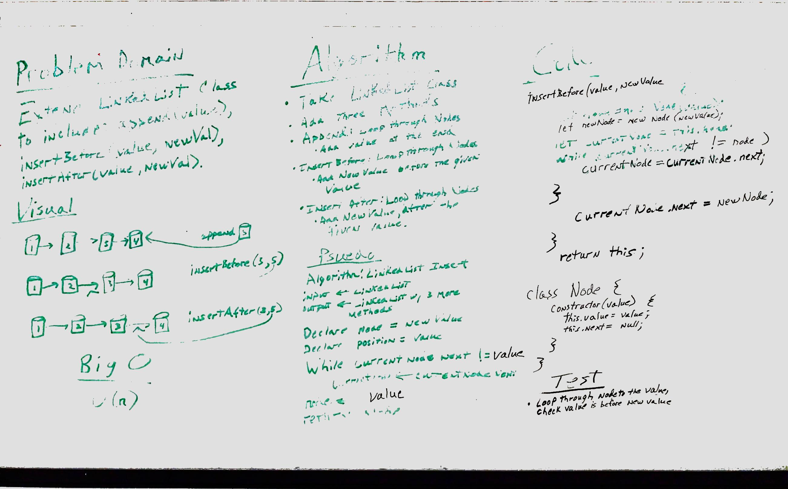

# Linked List Insertions

Lab Parter:
    Edward Mark Puzino

## Challenge

Write the following methods on a Linked List class:

    * .append(value)
        - adds a new node with the given value to the end of the list
    * .insertBefore(value, newValue)
        - adds a new node with the given value before the first node whose value matches the newValue
    * .insertAfter(value, newValue)
        - adds a new node with the given value after the first node whose value matches the newValue

## Solution

All three functions rely on a while loop to traverse the linked list- append traverses all the way to the end, while insertBefore and insertAfter traverse until the first node whose value matches the newValue given to it.

All three functions create a new node with the Node constructor and a value given to it as an input.

append() inserts the new node at the end of the list.

insertBefore() inserts the new node before the first node matching its search key by caching the rest of the linked list, setting the current node to the value of the new node, and then setting the next of the current node to the cache.

insertAfter() does exactly the same thing but manually traverses one node further before insertion.

## Notes

The only part I couldn't get working was the case where insertBefore() is called on the last element of the list - there's something wonky with how I'm traversing it and I think it just traverses off the end of the list and never executes the code that inserts the new node.  I put in a bunch of logic statements to try to catch that case but nothing worked and I'm way over the amount of time I should have put into this already.  I had 3 other tests for that function so I skipped the one for that edge case so I can move on.