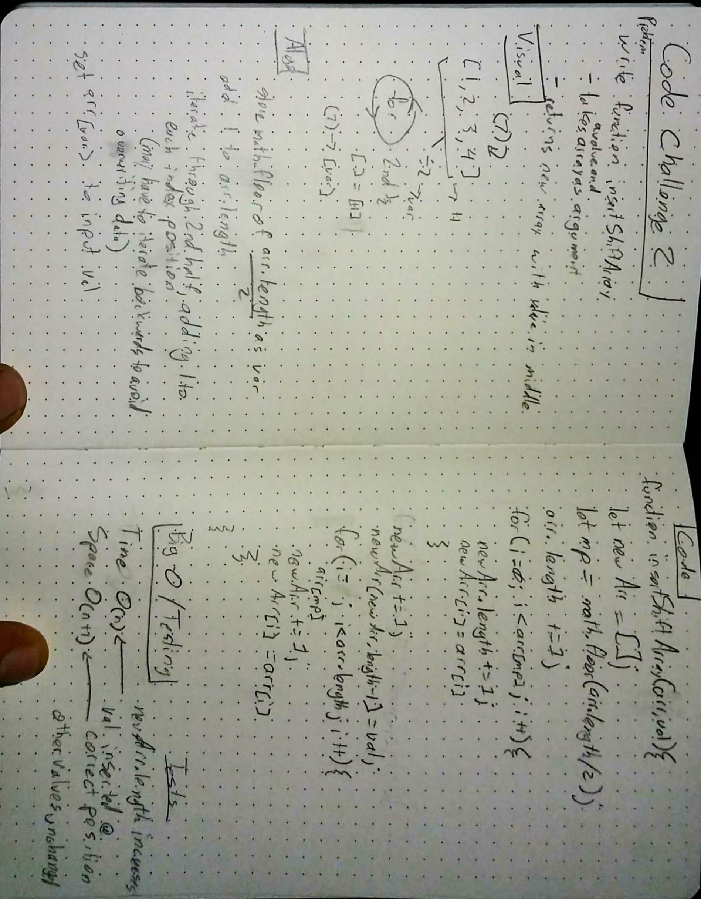

## Challenge

Write a function called insertShiftArray which takes in an array and the value to be added. Without utilizing any of the built-in methods available to your language, return an array with the new value added at the middle index.
​
## Solution

I divided the length of the array by two to find the midpoint, and then made two loops to iterate through each half.  The first loop adds each value to a newly declared array, and when finished running, the input value is added to the next index position.  The second loop picks up where the first one left off, iterating through the second half of the input array and adding each value to the return array.