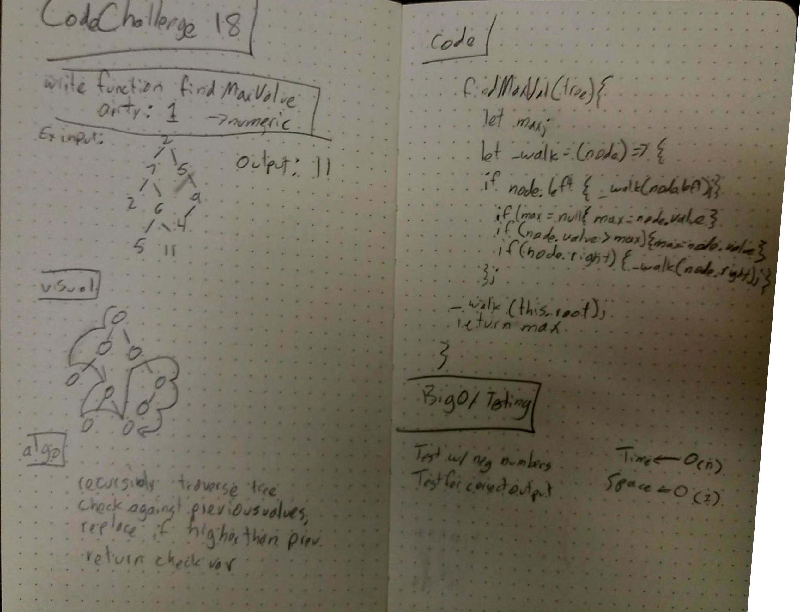

<!--  -->

##  Code Challenge 18
  Lab 10 - Data Structures and Algorithms - Stacks and Queues
  Codefellows 401n7
  James McDaniel

##  Challenge - 

  Extend binary tree class to find the maximum value in a binary tree

##  Approach and efficiency - 

  I initially thought I had to create a new search function, so I based my whiteboard on the in order traversal method of the binary tree class, but if i were to code it out as an extension of the other class, i would just call the in order traversal method and then search the returned array.

