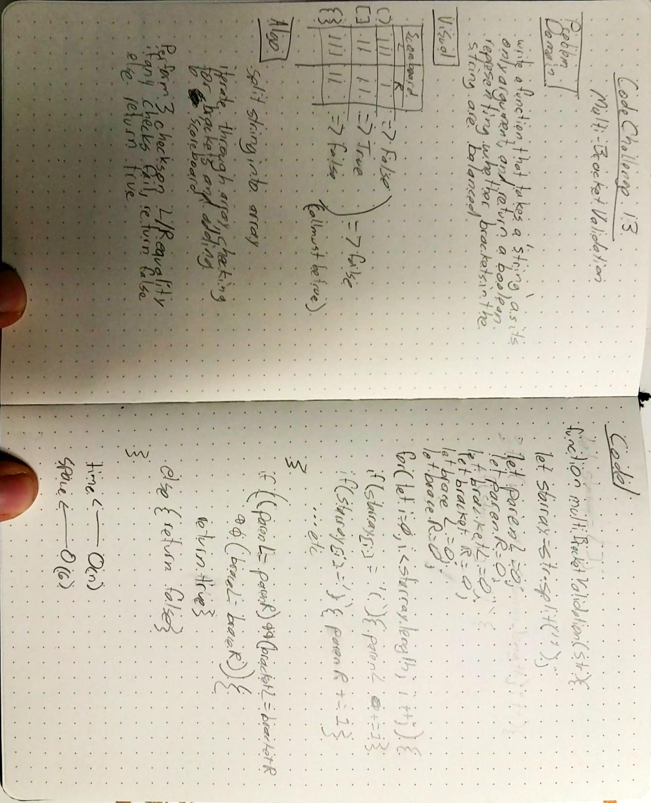

# Multi-Bracket-Validation

##  Challenge

  Write a function which takes a single argument, a string, and returns a boolean indicating whether the number of left-handed brackets (`({[`) is balanced by the appropriate number of right-handed brackets(`)}]`).

##  Approach and Efficiency

  I went for the simple solution, and created a 'scoreboard' of variables to keep track of the number of left and right-handed braces of each type.  I split the input string into an array, and iterated over the array, checking each position for braces, and tallying the count on the scoreboard.  After iteration, it performs 3 additional checks to determine if any type of brace has uneven representation, and returns true if none are found.  

  I feel like there is a simpler solution either working directly on the string, or consolidating some of the character checks into some sort of 'typeOf' check, but I couldn't figure it out, so I went with what I was pretty sure would work.

##  Solution

The approach I whiteboarded, for once, worked on the first almost exactly how I first wrote it out.  (I did change the final logic checks slightly to make the code more readable/writeable, but functionally it works the same both ways.)

