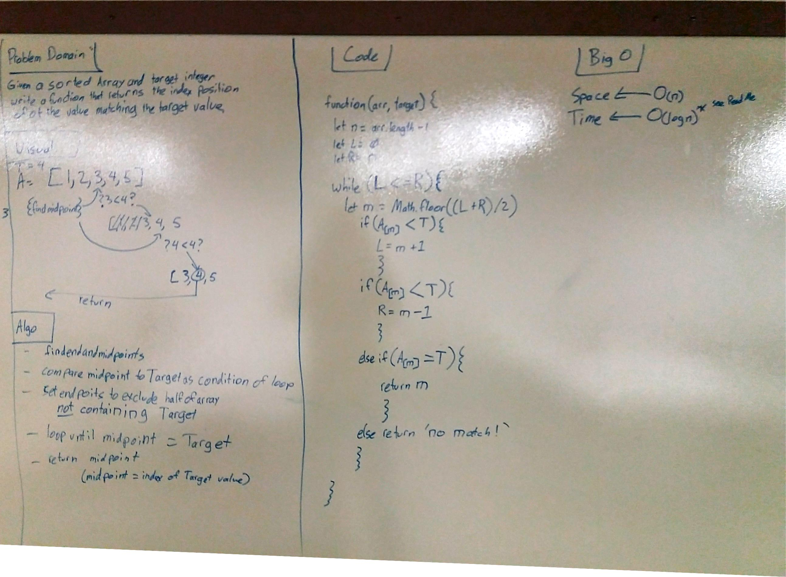
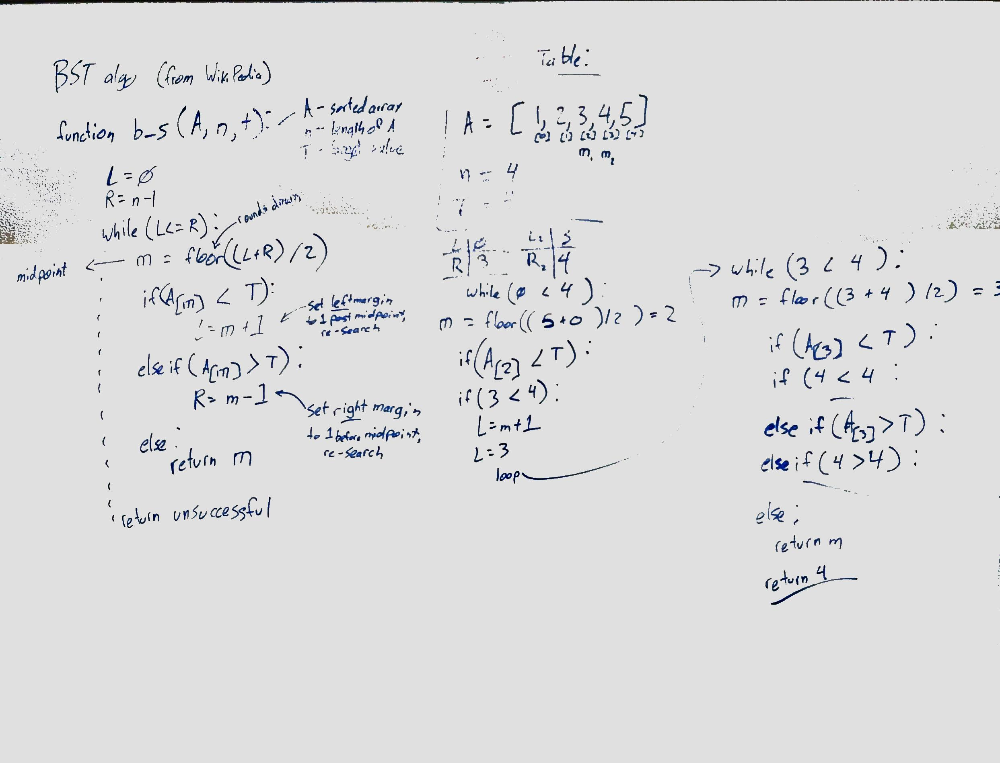

# Binary Search
  Code Challenge 03 - implement binary search tree on sorted array

## Challenge
  - Write a function, `BinarySearch` with airty of 2, a sorted array and a search key.
    - Implement testing with at least three assertations
## Solution

I started (over) by deconstructing the algorithm from Wikipedia and building a truth table to better understand how it works, and then built out my whiteboard from there.  
* Big O * 
    I remember reading that the binary search tree algorithm has a big O of log(n), and I think it was mentioned in lecture, but I legitimately have no idea how to calculate that.

## Testing

- I modularized the function so I could test it with jest; entering 'npm run test' from the console log will run all of them.
    it says I have 100% of lines covered, but that line 14 is uncovered.  Not sure what to do with that.  

## Resources

[Wikipedia BST algorithm](https://en.wikipedia.org/wiki/Binary_search_algorithm)
    I ordinarily wouldn't have looked up the algorithm, but it's listed as a resource, so I used it.  My lab partner and I tried to get to a solution without it and got pretty stuck.  It turns out we were really close.  We hadn't declared the L and R variables, and couldn't figure out the logic involved in determining the left and right margins to search within, especially in cases where both margins move as the search progresses.  It involved a lot of expressions nested within bracket notation, and would have made unreadable code even if it worked.
