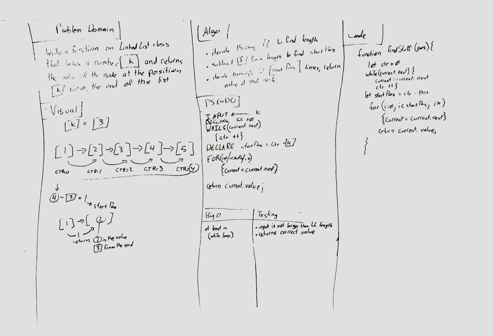

# Linked List Insertions

Lab Parter:
    Edward Mark Puzino

## Challenge

Write a method for the Linked List class which takes a number, k, as a parameter. Return the node’s value that is k from the end of the linked list.

​
## Solution

In order to determine the length of the linked list, we first iterated through it using a while loop, adding 1 to a global counter variable during each iteration.

We then subtracted the input variable, k, from the counter, and iterated through the list again that many times using a for loop, returning the value found at that node.  
