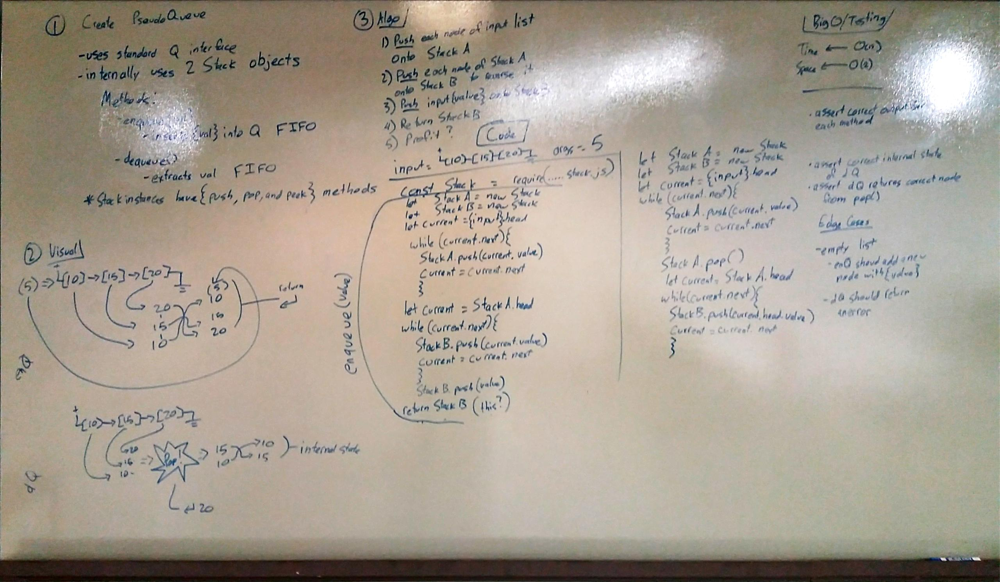

#  Code Challenge 11 - Implement a Queue Using Two Stacks

##  Challenge

Create a brand new PseudoQueue class. Do not use an existing Queue. Instead, this PseudoQueue class will implement the standard queue interface, but will internally only utilize 2 Stack objects. Ensure that you create your class with the following methods:

`enqueue(value)` - inserts value into the PseudoQueue, using a first-in, first-out approach.
`dequeue()`  - extracts a value from the PseudoQueue, using a first-in, first-out approach.
  The Stack instances have only push, pop, and peek methods. You should use your own Stack implementation. Instantiate these Stack objects in your PseudoQueue constructor.

##  Approach and Effieciency

  I tried to simply push everything onto one stack, then onto another, reversing its order, and return the second stack.  

##  Solution

  When I tried to code it out, nothing worked.  at all.  

